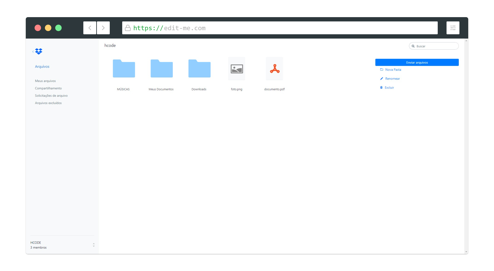

<h1 align="center">
   
</h1>

<h4 align="center"> 
	🚧 DropBox Clone 🚀 Concluido...  🚧
</h4>

## ✅ Funções

- [x] Enviar arquivo
- [x] Renomear
- [x] Nova Pasta
- [x] Excluir

## 🛠 Tecnologias

As seguintes ferramentas foram usadas na construção do projeto:

-  [JavaScript](https://developer.mozilla.org/pt-BR/docs/Web/JavaScript)
-  [HTML5](https://developer.mozilla.org/pt-BR/docs/Web/HTML)

## 🖥️ Plataforma adotada

  - WEB

## Project setup
```
npm install
```

### Compiles and hot-reloads for development
```
npm start
```

### Compiles and minifies for production
```
npm run build
```

### Run your tests
```
npm run test
```

### Lints and fixes files
```
npm run lint
```